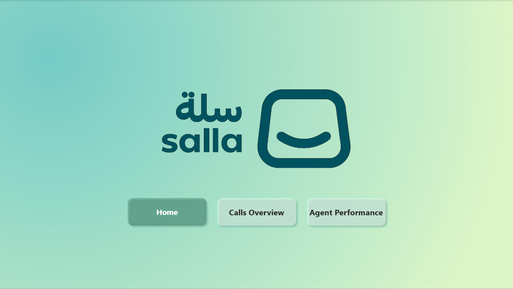
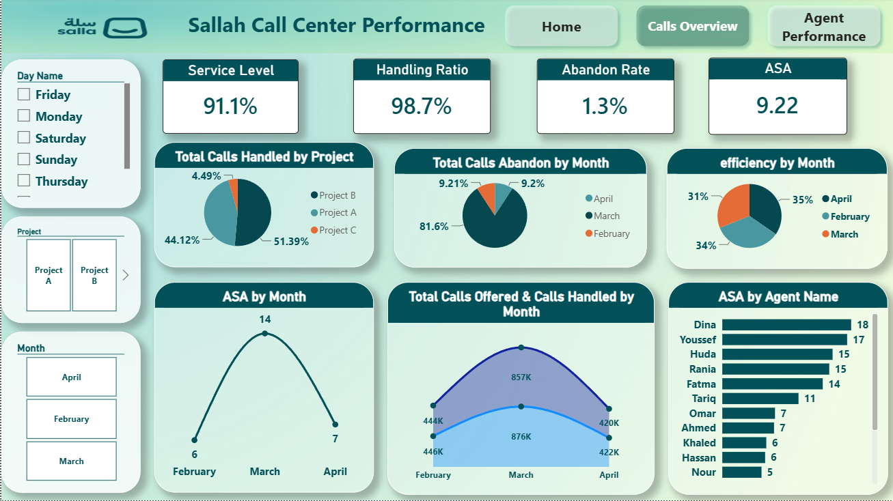
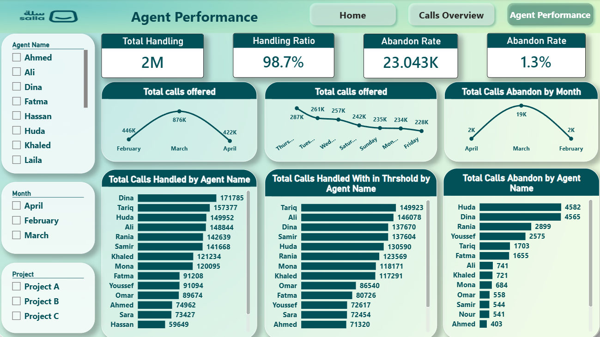
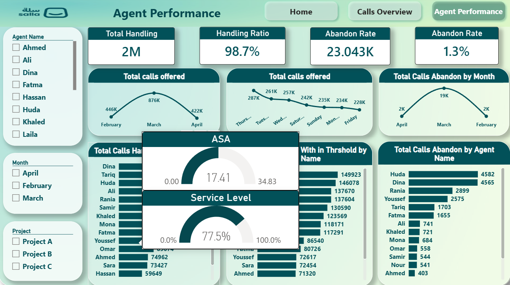

# Sallah Call Center Performance Dashboard

An interactive Power BI dashboard built to monitor and analyze Sallah call center performance across daily and monthly operations. It tracks core KPIs — Service Level, Handling Ratio, Abandon Rate, and ASA — with drill-down by agent and project.

## Tools & Skills Used

- **Power BI Desktop** — data modeling, DAX measures, report design
- **DAX (Data Analysis Expressions)** — custom KPI calculations and calculated tables
- **Data Modeling** — relationships across calls, agents, and project dimensions
- **Interactive Filtering** — slicers for Agent Name, Month, Day Name, and Project

## Report Pages

### 1. Calls Overview
High-level operational metrics for the call center as a whole.

**Key KPIs:**
| Metric | Value |
|---|---|
| Service Level | 91.1% |
| Handling Ratio | 98.7% |
| Abandon Rate | 1.3% |
| ASA (Average Speed of Answer) | 9.22 |

**Visuals:**
- Total Calls Handled by Project (pie chart)
- Total Calls Abandoned by Month
- Efficiency by Month
- ASA by Month (trend)
- Total Calls Offered vs. Calls Handled by Month (area chart)
- ASA by Agent Name (ranked bar chart)

### 2. Agent Performance
Deep-dive into individual agent productivity and outcomes.

**Key KPIs:**
| Metric | Value |
|---|---|
| Total Handling | 2M |
| Handling Ratio | 98.7% |
| Abandon Rate | 23.043K |
| Abandon Rate (%) | 1.3% |

**Visuals:**
- Total Calls Offered by Month (trend)
- Total Calls Offered by Day of Week
- Total Calls Abandoned by Month
- Total Calls Handled by Agent Name (ranked)
- Total Calls Handled Within Threshold by Agent Name
- Total Calls Abandoned by Agent Name

## Filters & Slicers

- **Agent Name** — Ahmed, Ali, Dina, Fatma, Hassan, Huda, Khaled, Laila, and others
- **Month** — February, March, April
- **Day Name** — Sunday through Saturday
- **Project** — Project A, Project B, Project C

## Screenshots

The screenshots below walk through the report's navigation and layout. The **Home** page serves as the landing screen, branded with the Sallah logo and navigation buttons that let users switch between **Calls Overview** and **Agent Performance**. The **Calls Overview** page summarizes center-wide metrics — Service Level, Handling Ratio, Abandon Rate, and ASA — alongside trends by month and project. The **Agent Performance** page breaks these metrics down by individual agent, with a drill-through view showing **ASA** and **Service Level** as gauge visuals when hovering over a specific data point.

For a live, interactive experience with full filtering and drill-down, view the report directly in Power BI: [Calls Overview - Sallah - Power BI](https://app.powerbi.com/groups/me/reports/6ef1df05-d80a-4c83-8442-936c06a07308/a098e974c53227019622?experience=power-bi)

### Home


### Calls Overview


### Agent Performance


### Agent Performance — Drill-through (ASA & Service Level)


## Key Insights

- Call volume peaked in **March** (876K calls offered) before declining in April.
- **Friday** consistently shows the lowest call volume across the week, while **Thursday** peaks.
- Handling ratio remains stable at **98.7%**, indicating strong operational efficiency.
- Top-performing agents by call handling volume: **Dina, Tariq, Huda, and Ali**.

## How to Use

1. Download Calls Overview - Sallah - Power BI
2. Open with Power BI Desktop
3. Refresh data connections (if applicable)
4. Use the slicers on the left panel to filter by agent, project, month, or day

## Repository Structure

```
sallah-call-center-dashboard/
├── README.md
├── Sallah_Dashboard.pbix
└── screenshots/
    ├── calls_overview.png
    └── agent_performance.png
```

---
*Built with Power BI | DAX-driven KPI framework*

